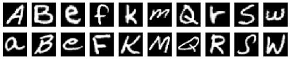

# K-Means Clustering with MapReduce Framework

## Introduction
The [`EMNIST`](https://www.nist.gov/itl/products-and-services/emnist-dataset) dataset is a dataset of handwritten letters, consisting of 124,800 training examples and 20,800 test examples. The task is to use K-Means clustering algorithm to recognize the handwritten letters. This project is a proof-of-concept for implementing K-Means clustering in MapReduce framework from scratch: writing the whole pipeline, including mappers and reducers, from scratch. In other words, I avoided using modern frameworks such as `Spark` (where K-Means clustering is implemented as part of `MLlib` in [here](https://spark.apache.org/docs/latest/ml-clustering.html)).



## Technical Details
I tested the pipeline on a `Hadoop 2.4` cluster on 4 `AWS EC2 t2.large` machines (1 NameNode, 3 DataNode). The mappers and reducers were written in `Python`, then I used `Hadoop Streaming` to run the pipeline. The command to run a pair of mapper and reducer was:

```
hadoop jar /usr/hdp/2.4.2.0-258/hadoop-mapreduce/hadoop-streaming.jar \
     -file mapper.py -mapper mapper.py  \
     -file reducer.py -reducer reducer.py \
     -input input/* \
     -output output
```

## Closing Remarks
Since the project was meant to be a proof-of-concept only, the results were not that impressive (on average, the pipeline was able to correctly classify $43.87\%$ of the letters); after all, K-Means Clustering is not a state-of-the-art machine learning algorithm. By being able to write K-Means clustering in MapReduce framework, we can extend the algorithm to distributed setting for scaling to huge datasets.
